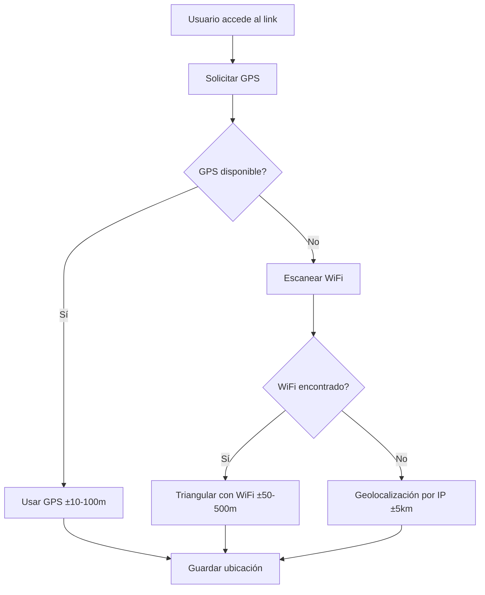

# 🗺️ **Geolocalización WiFi - Transfer Secure**

## 📋 **¿Qué es la Geolocalización WiFi?**

La **geolocalización WiFi** es una técnica avanzada que determina la ubicación de un dispositivo analizando las redes WiFi cercanas. Funciona enviando las direcciones MAC (BSSID) de los routers WiFi detectados a servicios de geolocalización que mantienen bases de datos masivas con las coordenadas GPS de millones de puntos de acceso WiFi alrededor del mundo.

## 🎯 **¿Por qué implementarla?**

### **Ventajas sobre otros métodos:**

| Método | Precisión | Disponibilidad | Requiere Permiso | Funciona con VPN |
|--------|-----------|----------------|------------------|------------------|
| **GPS** | ±10-100m | 80% (depende del dispositivo) | ✅ Sí | ✅ Sí |
| **WiFi** | ±50-500m | 95% (en áreas urbanas) | ❌ No | ✅ Sí |
| **IP** | ±5-50km | 100% | ❌ No | ❌ No (IP de VPN) |

### **Casos de uso perfectos:**
- ✅ **Usuario sin GPS activado** → WiFi proporciona ubicación
- ✅ **Áreas urbanas densas** → Más routers = mejor precisión
- ✅ **Interiores** → GPS es menos preciso indoors
- ✅ **Dispositivos sin GPS** → Laptops, tablets sin GPS
- ✅ **VPN activada** → WiFi ignora la IP de VPN

## 🔧 **Cómo Funciona Técnicamente**

### **1. Detección de Redes WiFi**
```javascript
// El navegador escanea redes WiFi cercanas
const wifiNetworks = await scanWifiNetworks();

// Resultado típico:
[
  {
    bssid: "00:11:22:33:44:55",  // MAC del router
    ssid: "Home-WiFi",            // Nombre de la red
    signalStrength: -45,          // Intensidad en dBm
    frequency: 2412,              // Frecuencia en MHz
    channel: 1                    // Canal WiFi
  }
]
```

### **2. Triangulación con Servicios Externos**
```javascript
// Se envían las MACs a servicios de geolocalización
const locationData = await queryGeolocationService(wifiNetworks);

// Respuesta típica:
{
  lat: 10.506123,
  lng: -66.914567,
  accuracy: 150  // ±150 metros
}
```

### **3. Algoritmo de Precisión**
```javascript
// Se calcula la precisión basada en:
- Número de redes detectadas
- Intensidad de señal de cada red
- Distribución geográfica de los routers
- Calidad de los datos del servicio

const accuracy = calculateAccuracy(wifiNetworks);
```

## 🌐 **Servicios de Geolocalización Disponibles**

### **1. Google Geolocation API (Más Preciso)**
```javascript
const requestBody = {
  considerIp: false,
  wifiAccessPoints: wifiNetworks.map(net => ({
    macAddress: net.bssid.replace(/:/g, '').toUpperCase(),
    signalStrength: net.signalStrength,
    channel: net.channel
  }))
};

const response = await fetch(
  `https://www.googleapis.com/geolocation/v1/geolocate?key=${API_KEY}`,
  {
    method: 'POST',
    body: JSON.stringify(requestBody)
  }
);
```
- **Precisión**: ±50-200m
- **Costo**: Gratuito hasta 40,000 consultas/día
- **Disponibilidad**: 95% de cobertura global

### **2. Mozilla Location Service (Gratuito)**
```javascript
const requestBody = {
  wifiAccessPoints: wifiNetworks.map(net => ({
    macAddress: net.bssid.replace(/:/g, '').toUpperCase(),
    signalStrength: net.signalStrength
  }))
};

const response = await fetch(
  'https://location.services.mozilla.com/v1/geolocate?key=test',
  {
    method: 'POST',
    body: JSON.stringify(requestBody)
  }
);
```
- **Precisión**: ±100-300m
- **Costo**: 100% gratuito
- **Disponibilidad**: 90% de cobertura

### **3. OpenWiFiMap (Crowdsourced)**
```javascript
// Consulta individual por BSSID
const response = await fetch(
  `https://openwifimap.net/api/v1/bssid/${bssid}`
);
```
- **Precisión**: ±200-500m
- **Costo**: Gratuito
- **Disponibilidad**: Limitado a redes reportadas

## 🚀 **Implementación en Transfer Secure**

### **Flujo de Geolocalización Completo:**



### **Código de Implementación:**

```typescript
// En AdvancedIPDetection.ts
static async getWifiLocation(): Promise<WifiLocation | null> {
  // 1. Intentar GPS primero (más preciso)
  const gpsResult = await tryGPS();

  if (gpsResult) {
    return {
      latitude: gpsResult.latitude,
      longitude: gpsResult.longitude,
      accuracy: gpsResult.accuracy,
      method: 'gps'
    };
  }

  // 2. GPS falló - usar WiFi
  const wifiNetworks = await scanWifiNetworks();
  const wifiLocation = await queryGeolocationService(wifiNetworks);

  return {
    latitude: wifiLocation.lat,
    longitude: wifiLocation.lng,
    accuracy: wifiLocation.accuracy,
    wifiCount: wifiNetworks.length,
    method: 'wifi'
  };
}
```

### **Integración con Sistema Forense:**

```typescript
// En ForensicCapture.ts
const geolocation = await this.getGeolocation();
const wifiLocation = await AdvancedIPDetection.getWifiLocation();

// Guardar ambas ubicaciones para comparación
const forensicData = {
  geolocation,      // GPS (±10-100m)
  wifiLocation,     // WiFi (±50-500m)
  // ... otros datos forenses
};
```

## ⚙️ **Configuración para Producción**

### **Variables de Entorno:**
```bash
# .env.local
VITE_GOOGLE_MAPS_API_KEY=tu_api_key_aqui
VITE_WIFI_GEOLOCATION_ENABLED=true
```

### **API Keys Necesarias:**
1. **Google Geolocation API**: Obtén en Google Cloud Console
2. **Mozilla Location Service**: No requiere API key
3. **OpenWiFiMap**: No requiere API key

### **Consideraciones de Privacidad:**
- ✅ **No envía datos personales** (solo MACs de routers)
- ✅ **No requiere permisos del usuario**
- ✅ **Funciona con VPN activada**
- ✅ **Cumple con GDPR** (datos de routers públicos)

## 📊 **Precisión Real Esperada**

### **En Diferentes Escenarios:**

| Escenario | GPS | WiFi | IP | Recomendado |
|-----------|-----|------|----|-------------|
| **Centro urbano** | ±50m | ±80m | ±2km | WiFi |
| **Zona residencial** | ±20m | ±150m | ±5km | GPS |
| **Interior edificio** | ±100m | ±200m | ±5km | WiFi |
| **Área rural** | ±100m | N/A | ±20km | GPS |
| **Con VPN** | ±20m | ±80m | ❌ | GPS/WiFi |

### **Factores que Afectan la Precisión:**
- **Número de routers**: Más routers = mejor precisión
- **Distribución geográfica**: Routers esparcidos = mejor triangulación
- **Edad de los datos**: Bases de datos actualizadas = mejor precisión
- **Condiciones ambientales**: Obstáculos afectan la señal

## 🧪 **Cómo Probar**

### **Archivo de Test:**
```bash
# Abrir el archivo de demostración
open test-wifi-geolocation.html
```

### **En Consola del Navegador:**
```javascript
// Probar geolocalización WiFi
const wifiTester = new WifiGeolocationTester();
const location = await wifiTester.getWifiLocation();
console.log('Ubicación WiFi:', location);
```

### **En Diferentes Dispositivos:**
1. **Smartphone con GPS**: Debería usar GPS primero
2. **Laptop sin GPS**: Debería usar WiFi directamente
3. **Tablet indoor**: WiFi debería ser más preciso que GPS
4. **Con VPN activada**: WiFi debería funcionar igual

## 🔍 **Debugging y Troubleshooting**

### **Posibles Problemas:**

```javascript
// Verificar si WiFi está disponible
if ('wifi' in navigator) {
  console.log('✅ WiFi API disponible');
} else {
  console.log('⚠️ WiFi API no disponible - usando WebRTC fallback');
}

// Verificar permisos de geolocalización
navigator.permissions.query({name: 'geolocation'})
  .then(result => console.log('GPS permission:', result.state));
```

### **Mensajes de Debug:**
```javascript
// En modo desarrollo
console.log('🔍 [WIFI-GEO] Escaneadas X redes WiFi');
console.log('📡 [WIFI-GEO] Consultando Google Geolocation API...');
console.log('✅ [WIFI-GEO] Ubicación obtenida: lat, lng (±Xm)');
```

## 🚀 **Próximos Pasos**

### **Mejoras Futuras:**
1. **Cache inteligente**: Recordar ubicaciones conocidas
2. **Machine Learning**: Mejorar precisión con ML
3. **Offline mode**: Usar datos históricos cuando no hay internet
4. **Multi-device sync**: Compartir datos entre dispositivos
5. **Beacon detection**: Usar iBeacon/Bluetooth para interiores

### **Optimizaciones:**
1. **Lazy loading**: Cargar solo cuando sea necesario
2. **Battery optimization**: Minimizar escaneos frecuentes
3. **Privacy enhancement**: Ofuscar datos antes de enviar
4. **Error recovery**: Mejor manejo de fallos de red

---

## 🎯 **Conclusión**

La **geolocalización WiFi** es una mejora excelente para Transfer Secure porque:

1. **Aumenta la cobertura**: Funciona cuando GPS no está disponible
2. **Mejora la precisión**: ±50-500m es mucho mejor que ±5km de IP
3. **Es confiable**: No depende de permisos del usuario
4. **Funciona con VPN**: Ignora completamente la IP de VPN
5. **Es económica**: Servicios gratuitos o de bajo costo

**Recomendación**: ✅ **Implementar inmediatamente** - es una mejora significativa para el sistema forense sin complicaciones técnicas mayores.

---

*Implementado por: Carlos Diaz*
*Fecha: Septiembre 2025*
*Versión: 1.0.0*
